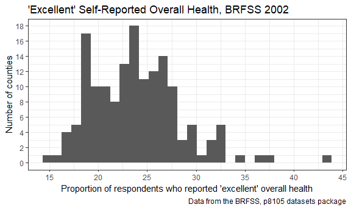
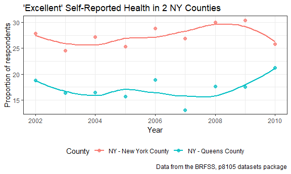

p8105\_hw2\_js5431
================
J Shearston
September 25, 2018

-   [Problem \#1](#problem-1)
    -   [Importing and tidying up the data](#importing-and-tidying-up-the-data)
    -   [Describing the data](#describing-the-data)
    -   [Question responses](#question-responses)
-   [Problem \#2](#problem-2)
    -   [Reading in and cleaning Mr. Trash Wheel data](#reading-in-and-cleaning-mr.-trash-wheel-data)
    -   [Reading in and cleaning precipitation data](#reading-in-and-cleaning-precipitation-data)
    -   [Description of the Mr. Trash Wheel dataset](#description-of-the-mr.-trash-wheel-dataset)
-   [Problem \#3](#problem-3)
    -   [Loading and cleaning BRFSS data](#loading-and-cleaning-brfss-data)
    -   [Answering / doing four items](#answering-doing-four-items)

Problem \#1
-----------

#### Importing and tidying up the data

``` r
nyc_transit = read_csv(file = "./data/NYC_Transit_Subway_Entrance_And_Exit_Data.csv") %>% 
  janitor::clean_names() %>% 
  select(line:station_longitude, entry, entrance_type, vending, ada, starts_with("route")) %>% 
  mutate(entry = recode(entry, "YES" = TRUE, "NO" = FALSE)) %>% 
  rename(station_lat = station_latitude, 
         station_long = station_longitude)
#nyc_transit
```

#### Describing the data

*Instructions:* Write a short paragraph about this dataset – explain briefly what variables the dataset contains, describe your data cleaning steps so far, and give the dimension (rows x columns) of the resulting dataset. Are these data tidy?

*Response:* This dataset contains information on New York City subway lines and stations, including the line (e.g. 4th Avenue), station name, exact station location (latitute and longitude), routes served (e.g. A, 1), entrances and entrance types, presence of vendors, and ADA compliance. The data have been imported to R, variable names have been cleaned, variables have been re-ordered to make them easier to read, and the "entry" variable has been changed from a character to a logical variable. In its current form, the data is in a table of dimensions 1868 x 19. The data are somewhat tidy, but more work could be done. I would suggest creating an additional variable that sums the number of routes served by a station.

#### Question responses

**Item: How many distinct stations are there? Note that stations are identified both by name and by line (e.g. 125th St A/B/C/D; 125st 1; 125st 4/5); the distinct function may be useful here.**

There are 456 distinct stations in this dataset.

**Item: How many stations are ADA compliant?**

There are 468 ADA compliant stations.

**Item: What proportion of station entrances / exits without vending allow entrance?**

69 out of 183 station entrances/exits without venidng allow entrance.

**Item: Reformat data so that route number and route name are distinct variables. How many distinct stations serve the A train? How many are ADA compliant?**

Reformatting

`r` distinct stations serve the A train. Of those, `r` are ADA compliant.

Problem \#2
-----------

#### Reading in and cleaning Mr. Trash Wheel data

``` r
trash_wheel = readxl::read_excel("./data/HealthyHarborWaterWheelTotals2017-9-26.xlsx",
                                 sheet = "Mr. Trash Wheel", 
                                 range = "A2:N258") %>% 
  janitor::clean_names() %>% 
  filter(!is.na(dumpster)) %>% 
  mutate(
    sports_balls = round(sports_balls, digits = 0),
    sports_balls = as.integer(sports_balls)
    )
```

#### Reading in and cleaning precipitation data

2017 Precipitation Data

``` r
precip_2017 = readxl::read_excel("./data/HealthyHarborWaterWheelTotals2017-9-26.xlsx",
                                 sheet = "2017 Precipitation", 
                                 range = "A2:B14") %>% 
  janitor::clean_names() %>%
  rename(precip_inches = total) %>% 
  mutate(year = "2017",
         month = month.name) %>% 
  filter(!is.na(precip_inches))

View(precip_2017)
```

2016 Precipitation Data

``` r
precip_2016 = readxl::read_excel("./data/HealthyHarborWaterWheelTotals2017-9-26.xlsx",
                                 sheet = "2016 Precipitation", 
                                 range = "A2:B14") %>% 
  janitor::clean_names() %>%
  rename(precip_inches = total) %>% 
  mutate(year = "2016",
         month = month.name)

View(precip_2016)
```

Combining 2016 and 2017 Precipitation Data

``` r
precip = bind_rows(precip_2016, precip_2017)
View(precip)
summary(precip)
```

    ##     month           precip_inches       year          
    ##  Length:20          Min.   :0.620   Length:20         
    ##  Class :character   1st Qu.:2.125   Class :character  
    ##  Mode  :character   Median :3.400   Mode  :character  
    ##                     Mean   :3.494                     
    ##                     3rd Qu.:4.695                     
    ##                     Max.   :7.090

#### Description of the Mr. Trash Wheel dataset

*Instructions: Write a paragraph about these data; you are encouraged to use inline R. Be sure to note the number of observations in both resulting datasets, and give examples of key variables. For available data, what was the total precipitation in 2017? What was the median number of sports balls in a dumpster in 2016?*

The Mr. Trash Wheel dataset provides a summary of the amount of trash collected by the Mr. Trash Wheel harbor cleaning device, and has 215 rows and 14 columns. Information is organized by dumpster number, and Key variables include date specific information such as year, month, and actual date, volume and weight of trash, and a series of variables about specific types of trash (e.g. plastic bottles, cigarette butts, sports balls). Finally, the number of homes powered by the collected trash is also included (woohoo!).

The precipiation dataset includes precipitation in inches from 2016 and 2017. There were 20 rows and 3 columns in the dataset, including information from January of 2016 to August of 2017. Key variables included year (2016 or 2017), precipiation in inches, and month.

The total precipitation in 2017 for January-August was 29.93 inches. In 2016, the median number of sports balls accumulated by Mr. Trash Wheel was 26.

Problem \#3
-----------

#### Loading and cleaning BRFSS data

``` r
devtools::install_github("p8105/p8105.datasets")
```

    ## Skipping install of 'p8105.datasets' from a github remote, the SHA1 (21f5ad1c) has not changed since last install.
    ##   Use `force = TRUE` to force installation

``` r
library(p8105.datasets)

brfss = p8105.datasets::brfss_smart2010 %>% 
  janitor::clean_names() %>%
  filter(topic == "Overall Health") %>% 
  select(year, locationabbr, locationdesc, response, data_value) %>% 
  spread(key = response, value = data_value) %>% 
  janitor::clean_names() %>% 
  mutate(ex_vg = excellent + very_good) %>% 
  select(year, locationabbr, locationdesc, ex_vg, excellent,
         very_good, good, fair, poor) # re-ordering for my benefit
```

#### Answering / doing four items

*Item 1: How many unique locations are included in the dataset? Is every state represented? What state is observed the most?*

-   404 unique locations are included in the dataset.

-   Every state is represented.

``` r
summarise(brfss, unique_state = n_distinct(locationabbr))
```

    ## # A tibble: 1 x 1
    ##   unique_state
    ##          <int>
    ## 1           51

-   Florida is the most observed state.

``` r
table(brfss$locationabbr)
```

    ## 
    ##  AK  AL  AR  AZ  CA  CO  CT  DC  DE  FL  GA  HI  IA  ID  IL  IN  KS  KY 
    ##  11  18  21  32  52  59  47   9  27 122  27  31  14  32  25  21  38   9 
    ##  LA  MA  MD  ME  MI  MN  MO  MS  MT  NC  ND  NE  NH  NJ  NM  NV  NY  OH 
    ##  45  79  90  31  34  33  25  23  18 115  18  53  48 146  43  18  65  59 
    ##  OK  OR  PA  RI  SC  SD  TN  TX  UT  VA  VT  WA  WI  WV  WY 
    ##  40  33  59  38  63  18  26  71  50   4  48  97   9   9  22

*Item 2: In 2002, what is the median of the “Excellent” response value?*

The median "Excellent" response in 2002 is 23.6.

*Item 3: Make a histogram of “Excellent” response values in the year 2002.*

``` r
filter(brfss, year == "2002") %>% 
  ggplot(aes(x = excellent)) + 
  geom_histogram() +
  labs(
    title = "'Excellent' Self-Reported Overall Health, BRFSS 2002",
    x = "Proportion of respondents who reported 'excellent' overall health",
    y = "Number of counties",
    caption = "Data from the BRFSS, p8105 datasets package") + 
  scale_x_continuous(breaks = c(5, 10, 15, 20, 25, 30, 35, 40, 45),
                   labels = c(5, 10, 15, 20, 25, 30, 35, 40, 45)) + 
  scale_y_continuous(breaks = c(0, 2, 4, 6, 8, 10, 12, 14, 16, 18, 20),
                   labels = c(0, 2, 4, 6, 8, 10, 12, 14, 16, 18, 20))
```

    ## `stat_bin()` using `bins = 30`. Pick better value with `binwidth`.

    ## Warning: Removed 2 rows containing non-finite values (stat_bin).



*Item 4: Make a scatterplot showing the proportion of “Excellent” response values in New York County and Queens County (both in NY State) in each year from 2002 to 2010.*

``` r
filter(brfss, 
       locationdesc == "NY - New York County" | locationdesc == "NY - Queens County") %>% 
  ggplot(aes(x = year, y = excellent, color = locationdesc)) +
  geom_point(alpha = .75, size = 2) +
  geom_smooth(se = FALSE) +
  labs(
    title = "'Excellent' Self-Reported Health in 2 NY Counties",
    x = "Year",
    y = "Proportion of respondents",
    caption = "Data from the BRFSS, p8105 datasets package") + 
  scale_color_hue(name = "County")
```

    ## `geom_smooth()` using method = 'loess' and formula 'y ~ x'


